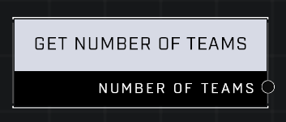

# Get Number Of Teams

## Description
Gets the number of teams with active players

## Node Type
Nodes fall into two basic categories: Data and Execution. This node supplies Data for an Execution node.

## Inputs
| Input | Type | Required | Description |
|------------------|------------------|----------|--------------------------------------------------------------|
| (none) | | | |

## Outputs
| Output | Type | Description |
|------------------|------------------|--------------------------------------------------------------|
| Number of Teams | Number | How many teams with players are in the game. |

\
\
**Contributors**

AddiCt3d 2CHa0s