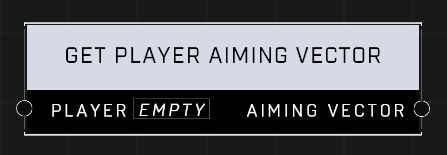

# Get Player Aiming Vector

## Description
Returns the Player's aiming vector. Returns global forward if the Player is invalid.

## Node Type
Nodes fall into two basic categories: Data and Execution. This node supplies Data for an Execution node.

## Inputs
| Input | Type | Required | Description |
|------------------|------------------|----------|--------------------------------------------------------------|
| Player | Player | Yes | Which player to get aiming vector for. |

## Outputs
| Output | Type | Description |
|------------------|------------------|--------------------------------------------------------------|
| Aiming Vector | Vector3 | Given player's aiming vector. |

\
\
**Contributors**

AddiCt3d 2CHa0s