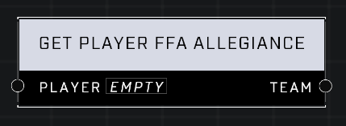

# Get Player FFA Allegiance

## Description
Gets the Team Allegiance the Player appears to be on. Allegiance affects friend or foe behaviors in Free For All modes. Has no effect in Team games.

## Node Type
Nodes fall into two basic categories: Data and Execution. This node supplies Data for an Execution node.

## Inputs
| Input | Type | Required | Description |
|------------------|------------------|----------|--------------------------------------------------------------|
| Player | Player | Yes | Which player to get FFA allegiance for. |

## Outputs
| Output | Type | Description |
|------------------|------------------|--------------------------------------------------------------|
| Team | Team | Given player's FFA Allegiance team. |

\
\
**Contributors**

AddiCt3d 2CHa0s