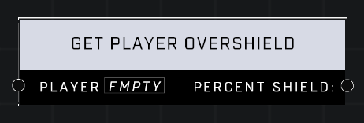

# Get Player Overshield

## Description
Gets the Player current overshield value from 0 to 1.

## Node Type
Nodes fall into two basic categories: Data and Execution. This node supplies Data for an Execution node.

## Inputs
| Input | Type | Required | Description |
|------------------|------------------|----------|--------------------------------------------------------------|
| Player | Player | Yes | Which player to get overshield status for. |

## Outputs
| Output | Type | Description |
|------------------|------------------|--------------------------------------------------------------|
| Percent Shield: | Number | What percentage of player's maxiumum shield player currently has. |

\
\
**Contributors**

AddiCt3d 2CHa0s