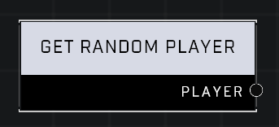

# Get Random Player

## Description
Returns a random player. In games with one player, will always return that player, making it helpful for script debugging.

## Node Type
Nodes fall into two basic categories: Data and Execution. This node supplies Data for an Execution node.

## Inputs
| Input | Type | Required | Description |
|------------------|------------------|----------|--------------------------------------------------------------|
| (none) | | | |

## Outputs
| Output | Type | Description |
|------------------|------------------|--------------------------------------------------------------|
| Player | Player | A random player. |

\
\
**Contributors**

AddiCt3d 2CHa0s