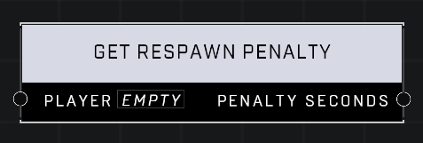

# Get Respawn Penalty

## Description
Returns the additional penalty applied to the Player beyond the game mode's default respawn setting, if any.

## Node Type
Nodes fall into two basic categories: Data and Execution. This node supplies Data for an Execution node.

## Inputs
| Input | Type | Required | Description |
|------------------|------------------|----------|--------------------------------------------------------------|
| Player | Player | Yes | Which player to check penalty for. |

## Outputs
| Output | Type | Description |
|------------------|------------------|--------------------------------------------------------------|
| Penalty Seconds | Number | How many seconds of added respawn penalty player has. |

\
\
**Contributors**

AddiCt3d 2CHa0s