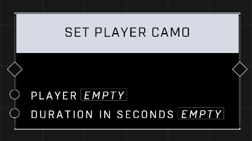

# Set Player Camo

## Description

Enables active camo on the Player for the Duration in Seconds. Warning! This node has limited duration. It's better to apply a trait set using Trait: VFX - Active Camouflage to avoid these limitations.

## Node Type

Nodes fall into two basic categories: Data and Execution. This node Executes a function directly in the node string.

## Inputs

\| Player | Player | Yes | Which player to set camo for. | | Duration In Seconds | Number | Yes | How many seconds camo will last. |

## Outputs

| Output | Type | Description |
| ------ | ---- | ----------- |
| (none) |      |             |

\
\
**Contributors**

AddiCt3d 2CHa0s
