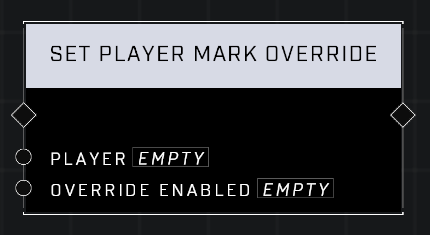

# Set Player Mark Override

## Description
Set Override Enabled to true to override the Player's Mark behavior for scripting. Overridden players will not create navmarkers, Event Feed messages, or audio for other players when they Mark.

## Node Type
Nodes fall into two basic categories: Data and Execution. This node Executes a function directly in the node string.

## Inputs
| Input | Type | Required | Description |
|------------------|------------------|----------|--------------------------------------------------------------|
| Player | Player | Yes | Which player to set Mark Override for. |
| Override Enabled | Boolean | Yes | Enabled if TRUE, disabled if FALSE. |

## Outputs
| Output | Type | Description |
|------------------|------------------|--------------------------------------------------------------|
| (none) | | |

\
\
**Contributors**

AddiCt3d 2CHa0s