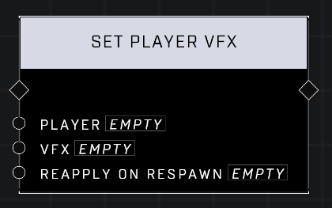

# Set Player VFX

## Description
Apply a VFX on the player. Using NONE clears the VFX and makes sure no VFX is reapplied on respawn.

## Node Type
Nodes fall into two basic categories: Data and Execution. This node Executes a function directly in the node string.

## Inputs
| Input | Type | Required | Description |
|------------------|------------------|----------|--------------------------------------------------------------|
| Player | Player | Yes | Which player to revive. |
| VFX | VFX | Yes | What VFX to use (Infected Alpha, Infected Alpha - Screen, Infected Beta, Infected Beta - Screen, None, VIP) |
| Reapply On Respawn | Boolean | Yes | If TRUE, player will retain VFX on respawn, otherwise it will be removed. |

## Outputs
| Output | Type | Description |
|------------------|------------------|--------------------------------------------------------------|
| (none) | | |

\
\
**Contributors**

AddiCt3d 2CHa0s