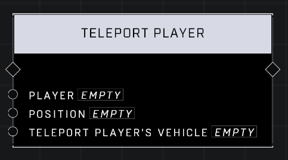

# Teleport Player

## Description
Teleports a Player to an absolute Position, optionally bringing their vehicle along

## Node Type
Nodes fall into two basic categories: Data and Execution. This node Executes a function directly in the node string.

## Inputs
| Input | Type | Required | Description |
|------------------|------------------|----------|--------------------------------------------------------------|
| Player | Player | Yes | Which player to teleport. |
| Position | Vector3 | Yes | Which position to teleport player to. |
| Teleport Player's Vehicle | Boolean | Yes | If TRUE and player is in a vehicle, vehicle will also be teleported. |

## Outputs
| Output | Type | Description |
|------------------|------------------|--------------------------------------------------------------|
| (none) | | |

\
\
**Contributors**

AddiCt3d 2CHa0s