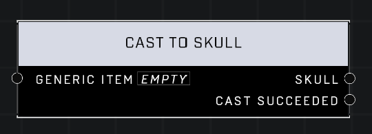

# Cast To Skull

## Description
Converts a Generic Item to a Skull. Incompatibility will result in invalid output.

## Node Type
Nodes fall into two basic categories: Data and Execution. This node Executes a function directly in the node string.

## Inputs
| Input | Type | Required | Description |
|------------------|------------------|----------|--------------------------------------------------------------|
| Generic Item | Item | Yes | Object to cast to skull. |

## Outputs
| Output | Type | Description |
|------------------|------------------|--------------------------------------------------------------|
| Skull | Object | The skull object that was being held as a generic item. |
| Cast Succeeded | Boolean | TRUE if generic item was successfully cast to a skull.

\
\
**Contributors**

AddiCt3d 2CHa0s