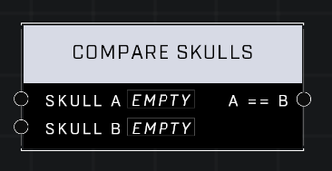

# Compare Skulls

## Description
Compares two Skull values

## Node Type
Nodes fall into two basic categories: Data and Execution. This node supplies Data for an Execution node.

## Inputs
| Input | Type | Required | Description |
|------------------|------------------|----------|--------------------------------------------------------------|
| Skull A | Object | Yes | Skull to compare to other input. |
| Skull B | Object | Yes | Skull to compare to other input. |

## Outputs
| Output | Type | Description |
|------------------|------------------|--------------------------------------------------------------|
| A == B | Boolean | TRUE if both objects are the same skull, otherwise is FALSE. |

\
\
**Contributors**

AddiCt3d 2CHa0s