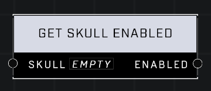

# Get Skull Enabled

## Description
Returns true if the Skull is enabled

## Node Type
Nodes fall into two basic categories: Data and Execution. This node supplies Data for an Execution node.

## Inputs
| Input | Type | Required | Description |
|------------------|------------------|----------|--------------------------------------------------------------|
| Skull | Object | Yes | Skull to check if it's enabled. |

## Outputs
| Output | Type | Description |
|------------------|------------------|--------------------------------------------------------------|
| Enabled | Boolean | TRUE if this skull is enabled, FALSE if not. |

\
\
**Contributors**

AddiCt3d 2CHa0s