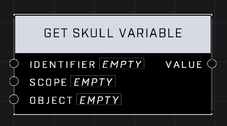

# Get Skull Variable

## Description
Get the Skull variable stored with the matching identifier in the matching Scope. The Object pin is only used when accessing the Object scope.

## Node Type
Nodes fall into two basic categories: Data and Execution. This node supplies Data for an Execution node.

## Inputs
| Input | Type | Required | Description |
|------------------|------------------|----------|--------------------------------------------------------------|
| Identifier | String | Yes | Custom name of the variable to be accessed. |
| Scope | Scope | Yes | Must match the scope of the declared variable to be accessed (Local, Global, Object). |
| Object | Object | No | If Object Scope, which object the variable is associated with. |

## Outputs
| Output | Type | Description |
|------------------|------------------|--------------------------------------------------------------|
| Value | Object | The skull being held in the variable, or nil. |

\
\
**Contributors**

AddiCt3d 2CHa0s