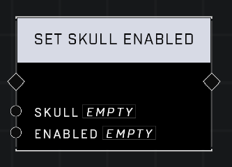

# Set Skull Enabled

## Description
Nodes that allow management of campaign Skulls

## Node Type
Nodes fall into two basic categories: Data and Execution. This node Executes a function directly in the node string.

## Inputs
| Input | Type | Required | Description |
|------------------|------------------|----------|--------------------------------------------------------------|
| Skull | Object | Yes | Skull to change status of. |
| Enabled | Boolean | Yes | Set TRUE to enable skull, FALSE to disable. |

## Outputs
| Output | Type | Description |
|------------------|------------------|--------------------------------------------------------------|
| (none) | | |

\
\
**Contributors**

AddiCt3d 2CHa0s