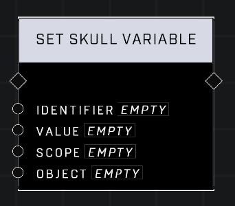

# Set Skull Variable

## Description
Nodes that allow management of campaign Skulls

## Node Type
Nodes fall into two basic categories: Data and Execution. This node Executes a function directly in the node string.

## Inputs
| Input | Type | Required | Description |
|------------------|------------------|----------|--------------------------------------------------------------|
| Identifier | String | Yes | Custom name of variable to set. |
| Value | Object | No | Skull to be held in this variable. |
| Scope | Scope | Yes | Must match the scope of the declared variable to be set (Local, Global, Object). |
| Object | Object | No | If Object Scope, which object the variable is associated with. |

## Outputs
| Output | Type | Description |
|------------------|------------------|--------------------------------------------------------------|
| (none) | | |

\
\
**Contributors**

AddiCt3d 2CHa0s