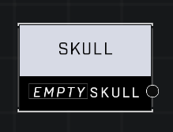

# Skull

## Description
Stores a Skull value

## Node Type
Nodes fall into two basic categories: Data and Execution. This node supplies Data for an Execution node.

## Inputs
| Input | Type | Required | Description |
|------------------|------------------|----------|--------------------------------------------------------------|
| (none) | | | |

## Outputs
| Output | Type | Description |
|------------------|------------------|--------------------------------------------------------------|
| Skull | Skull | (Bandanna, Black Eye, Blind, Boom, Catch, Cowbell, Famine, Fog, Grunt Birthday Party, IWHBYD, Mythic, Thunderstorm) |

\
\
**Contributors**

AddiCt3d 2CHa0s