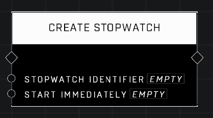

# Create Stopwatch

## Description
Creates a stopwatch to keep tim using the given Identifier. Use Start Immediately to begin ticking without calling the Start Stopwatch node.

## Node Type
Nodes fall into two basic categories: Data and Execution. This node Executes a function directly in the node string.

## Inputs
| Input | Type | Required | Description |
|------------------|------------------|----------|--------------------------------------------------------------|
| Stopwatch Identifier | String | Yes | Custom name of this stopwatch. |
| Start Immediately | Boolean | Yes | If TRUE, stopwatch starts immediately, if FALSE stopwatch must be started using scripts. |

## Outputs
| Output | Type | Description |
|------------------|------------------|--------------------------------------------------------------|
| (none) | | |

\
\
**Contributors**

AddiCt3d 2CHa0s