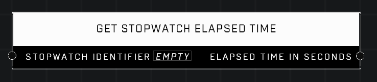

# Get Stopwatch Elapsed Time

## Description
Returns the cumulative number of seconds the stopwatch with the given Identifier has been running. Returns -1 if the stopwatch is invalid. Returns 0 if the stopwatch exists but has not been started.

## Node Type
Nodes fall into two basic categories: Data and Execution. This node supplies Data for an Execution node.

## Inputs
| Input | Type | Required | Description |
|------------------|------------------|----------|--------------------------------------------------------------|
| Stopwatch Identifier | String | Yes | Custom name of which stopwatch to get time from. |

## Outputs
| Output | Type | Description |
|------------------|------------------|--------------------------------------------------------------|
| Elapsed Time In Seconds | Number | How many seconds since stopwatch was started. |

\
\
**Contributors**

AddiCt3d 2CHa0s