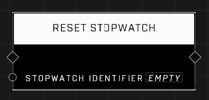

# Reset Stopwatch

## Description
Resets the Elapsed Time on the stopwatch with the given Identifier to 0 and then pauses the stopwatch. Use Start Stopwatch to start tracking time again.

## Node Type
Nodes fall into two basic categories: Data and Execution. This node Executes a function directly in the node string.

## Inputs
| Input | Type | Required | Description |
|------------------|------------------|----------|--------------------------------------------------------------|
| Stopwatch Identifier | String | Yes | Custom name of the stopwatch to reset. |

## Outputs
| Output | Type | Description |
|------------------|------------------|--------------------------------------------------------------|
| (none) | | |

\
\
**Contributors**

AddiCt3d 2CHa0s