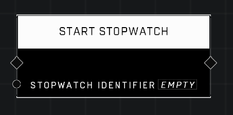

# Start Stopwatch

## Description
Makes the stopwatch with the given Identifier start (or resume) tracking time the moment the node is called.

## Node Type
Nodes fall into two basic categories: Data and Execution. This node Executes a function directly in the node string.

## Inputs
| Input | Type | Required | Description |
|------------------|------------------|----------|--------------------------------------------------------------|
| Stopwatch Identifier | String | Yes | Custom name of the stopwatch to start. |

## Outputs
| Output | Type | Description |
|------------------|------------------|--------------------------------------------------------------|
| (none) | | |

\
\
**Contributors**

AddiCt3d 2CHa0s