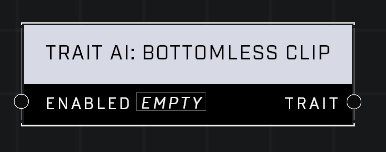

# Trait AI: Bottomless Clip

## Description
When enabled, affected AI Units will have infinite ammo and will not need to reload

## Node Type
Nodes fall into two basic categories: Data and Execution. This node supplies Data for an Execution node.

## Inputs
| Input | Type | Required | Description |
|------------------|------------------|----------|--------------------------------------------------------------|
| Enabled | Boolean | Yes | If TRUE, Bottomless Clip will be applied, and AI will have endless ammunition. |

## Outputs
| Output | Type | Description |
|------------------|------------------|--------------------------------------------------------------|
| Trait | Trait | Enables or disables Bottomless Clip for AI. |

\
\
**Contributors**

AddiCt3d 2CHa0s
