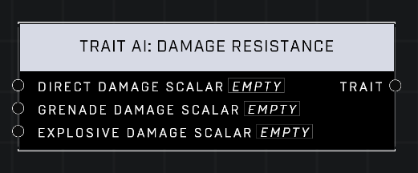

# Trait AI: Damage Resistance

## Description
Affects the amount of damage AI Unit receives from various sources. A scalar of 1.0 is the default for all pins. Lower values mean the AI Unit takes less damage from grenades and explosives. Lower values mean the AI Unit takes MORE damage from direct weapons fire.

## Node Type
Nodes fall into two basic categories: Data and Execution. This node supplies Data for an Execution node.

## Inputs
| Input | Type | Required | Description |
|------------------|------------------|----------|--------------------------------------------------------------|
| Direct Damage Scalar | Number (0.0 - 10,000) | Yes | Less than 1.0 means AI will take MORE damage from direct weapons fire, higher means AI will take LESS damage. |
| Grenade Damage Scalar | Number (0.0 - 10,000) | Yes | Less than 1.0 means AI will take LESS damage from grenades, higher means AI will take MORE damage.|
| Explosive Damage Scalar | Number (0.0 - 10,000) | Yes | Less than 1.0 means AI will take LESS damage from grenades, higher means AI will take MORE damage.|

## Outputs
| Output | Type | Description |
|------------------|------------------|--------------------------------------------------------------|
| Trait | Trait | The final Damage Resistance to be applied to AI. |

\
\
**Contributors**

AddiCt3d 2CHa0s
