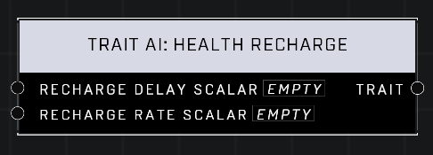

# Trait AI: Health Recharge

## Description
Affects how quickly AI Unit's health (non-shield) recharges. Higher values for the Recharge Delay Scalar means the health will wait longer before it begins recharging. Higher values for the Recharge Rate Scalar mean the health will fill up faster.

## Node Type
Nodes fall into two basic categories: Data and Execution. This node supplies Data for an Execution node.

## Inputs
| Input | Type | Required | Description |
|------------------|------------------|----------|--------------------------------------------------------------|
| Recharge Delay Scalar | Number (-10,000 - 10,000) | Yes | How many seconds to wait before shields will start to recharge. |
| Recharge Rate Scalar | Number (-1.0 - 10,000) | Yes | How quickly shields will recharge. Higher values mean faster.|

## Outputs
| Output | Type | Description |
|------------------|------------------|--------------------------------------------------------------|
| Trait | Trait | The final Health Recharge Trait to be applied to AI. |

\
\
**Contributors**

AddiCt3d 2CHa0s
