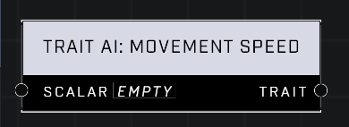

# Trait AI: Movement Speed

## Description
Affects how fast AI Unit moves. A Scalar of 1.0 is default. Higher values mean the AI Unit moves faster.

## Node Type
Nodes fall into two basic categories: Data and Execution. This node supplies Data for an Execution node.

## Inputs
| Input | Type | Required | Description |
|------------------|------------------|----------|--------------------------------------------------------------|
| Scalar | Number (0.0 - 10,000) | Yes | The higher the Scalar, the faster AI will move. Lower than 1.0 means AI will move slower than their default.|

## Outputs
| Output | Type | Description |
|------------------|------------------|--------------------------------------------------------------|
| Trait | Trait | The final Movement Speed With Turret to be applied to AI. |

\
\
**Contributors**

AddiCt3d 2CHa0s