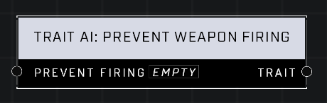

# Trait AI: Prevent Weapon Firing

## Description
Nodes that interact with traits that modify base AI behavior

## Node Type
Nodes fall into two basic categories: Data and Execution. This node supplies Data for an Execution node.

## Inputs
| Input | Type | Required | Description |
|------------------|------------------|----------|--------------------------------------------------------------|
| Prevent Firing | Boolean | Yes | If TRUE, AI will not be able to fire weapons. |

## Outputs
| Output | Type | Description |
|------------------|------------------|--------------------------------------------------------------|
| Trait | Trait | Outputs whether the Prevent Weapon Firing Trait is active or not.|

\
\
**Contributors**

AddiCt3d 2CHa0s
