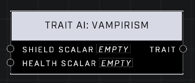

# Trait AI: Vampirism

## Description
Nodes that interact with traits that modify base AI behavior

## Node Type
Nodes fall into two basic categories: Data and Execution. This node supplies Data for an Execution node.

## Inputs
| Input | Type | Required | Description |
|------------------|------------------|----------|--------------------------------------------------------------|
| Shield Scalar | Number (0.0 - 10,000) | Yes | How much shields will regenerate based on damage the AI does to other Units.|
| Health Scalar | Number (0.0 - 10,000) | Yes | How much health will regenerate based on damage the AI does to other Units.|

## Outputs
| Output | Type | Description |
|------------------|------------------|--------------------------------------------------------------|
| Trait | Trait | Outputs how much shield and health AI can regenerate based off damage done to other Units.|

\
\
**Contributors**

AddiCt3d 2CHa0s
