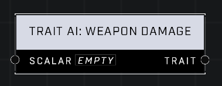

# Trait AI: Weapon Damage

## Description
Affects how much damage AI Unit deals with their weapons. A Scalar of 1.0 is default. Higher values mean the AI Unit deals more damage.

## Node Type
Nodes fall into two basic categories: Data and Execution. This node supplies Data for an Execution node.

## Inputs
| Input | Type | Required | Description |
|------------------|------------------|----------|--------------------------------------------------------------|
| Scalar | Number (0.0 - 10,000) | Yes | How much additional damage AI will do to other Units.|

## Outputs
| Output | Type | Description |
|------------------|------------------|--------------------------------------------------------------|
| Trait | Trait | Outputs the Trait that will give AI the extra damage. |

\
\
**Contributors**

AddiCt3d 2CHa0s
