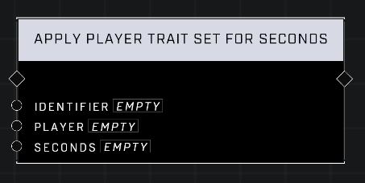

# Apply Player Trait Set For Seconds

## Description
Applies the Trait Set with the matching Identifier to the Player for the specified number of Seconds.

## Node Type
Nodes fall into two basic categories: Data and Execution. This node Executes a function directly in the node string.

## Inputs
| Input | Type | Required | Description |
|------------------|------------------|----------|--------------------------------------------------------------|
| Identifier | String | Yes | Which Trait Set to apply. |
| Player | Player | Yes | Which player to apply trait set to. |
| Seconds | Number | Yes | How many seconds player will have trait before it is removed. |

## Outputs
| Output | Type | Description |
|------------------|------------------|--------------------------------------------------------------|
| (none) | | |

\
\
**Contributors**

AddiCt3d 2CHa0s