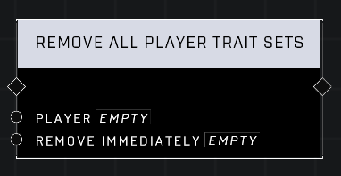

# Remove All Player Trait Sets

## Description
Removes all Trait Sets applied to the Player, resetting them to their default state. Optionally Remove Immediately or wait for the next respawn to take effect.

## Node Type
Nodes fall into two basic categories: Data and Execution. This node Executes a function directly in the node string.

## Inputs
| Input | Type | Required | Description |
|------------------|------------------|----------|--------------------------------------------------------------|
| Player | Player | Yes | Which player to remove all trait sets from. |
| Remove Immediately | Boolean | Yes | Set to TRUE to remove immediately, FALSE to remove on respawn. |

## Outputs
| Output | Type | Description |
|------------------|------------------|--------------------------------------------------------------|
| (none) | | |

\
\
**Contributors**

AddiCt3d 2CHa0s