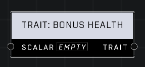

# Trait: Bonus Health

## Description
Gives a player bonus health as a percent of their base health. A Scalar of 0.0 is the default, for a health total of 90. For example, a value of 2 will give the player 180 extra health for a total of 270.

## Node Type
Nodes fall into two basic categories: Data and Execution. This node supplies Data for an Execution node.

## Inputs
| Input | Type | Required | Description |
|------------------|------------------|----------|--------------------------------------------------------------|
| Scalar | Number (0.0 - 10) | Yes | What percentage of the default to apply on top of current. |

## Outputs
| Output | Type | Description |
|------------------|------------------|--------------------------------------------------------------|
| Trait | Trait | Outputs this trait. |

\
\
**Contributors**

AddiCt3d 2CHa0s
