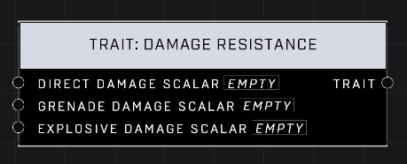

# Trait: Damage Resistance

## Description
Affects the amount of damage a player receives from various sources. A scalar of 1.0 is the default for all pins. Lower values mean the player takes less damage for grenades and explosives. Lower values mean the player takes MORE damage from direct weapons fire.

## Node Type
Nodes fall into two basic categories: Data and Execution. This node supplies Data for an Execution node.

## Inputs
| Input | Type | Required | Description |
|------------------|------------------|----------|--------------------------------------------------------------|
| Direct Damage Scalar | Number (0.0 - 10) | Yes | What percentage of default. |
| Grenade Damage Scalar | Number (0.0 - 10) | Yes | What percentage of default. |
| Explosive Damage Scalar | Number (0.0 - 10) | Yes | What percentage of default. |

## Outputs
| Output | Type | Description |
|------------------|------------------|--------------------------------------------------------------|
| Trait | Trait | The final Bonus Health to be applied to AI. |

\
\
**Contributors**

AddiCt3d 2CHa0s
