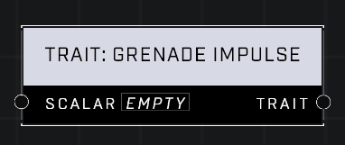

# Trait: Grenade Impulse

## Description
Affects how much physics impulse is imparted bya  player's grenade explosion. A Scalar of 1.0 is default. Higher values mean grenades push enemies back farther.

## Node Type
Nodes fall into two basic categories: Data and Execution. This node supplies Data for an Execution node.

## Inputs
| Input | Type | Required | Description |
|------------------|------------------|----------|--------------------------------------------------------------|
| Scalar | Number (0.0 - 10) | Yes | What percentage of default. |

## Outputs
| Output | Type | Description |
|------------------|------------------|--------------------------------------------------------------|
| Trait | Trait | Outputs this trait. |

\
\
**Contributors**

AddiCt3d 2CHa0s
