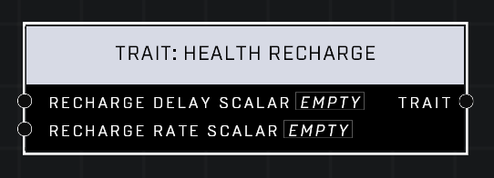

# Trait: Health Recharge

## Description
Affects how quickly a player's health (non-shield) recharges. Higher values for the Recharge Delay Scalar mean the health will wait longer before it begins recharging. Higher values for the Recharge Rate Scalar mean the health will fill up faster.

## Node Type
Nodes fall into two basic categories: Data and Execution. This node supplies Data for an Execution node.

## Inputs
| Input | Type | Required | Description |
|------------------|------------------|----------|--------------------------------------------------------------|
| Recharge Delay Scalar | Number (0.0 - 10) | Yes | What percentage of default. |
| Recharge Rate Scalar | Number (0.0 - 10) | Yes | What percentage of default. |

## Outputs
| Output | Type | Description |
|------------------|------------------|--------------------------------------------------------------|
| Trait | Trait | Outputs this trait. |

\
\
**Contributors**

AddiCt3d 2CHa0s
