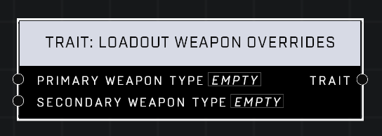

# Trait: Loadout Weapon Overrides

## Description
Overrides what weapons a player respawns with. Takes effect on the next respawn. Setting to None means no override, meaning the game variant's setting will once again determine the weapon for that slot.

## Node Type
Nodes fall into two basic categories: Data and Execution. This node supplies Data for an Execution node.

## Inputs
| Input | Type | Required | Description |
|------------------|------------------|----------|--------------------------------------------------------------|
| Primary Weapon Type | Weapon Type | No | Which weapon type to override default with. |
| Secondary Weapon Type | Weapon Type | No | Which weapon type to override default with |

## Outputs
| Output | Type | Description |
|------------------|------------------|--------------------------------------------------------------|
| Trait | Trait | Outputs this trait. |

\
\
**Contributors**

AddiCt3d 2CHa0s
