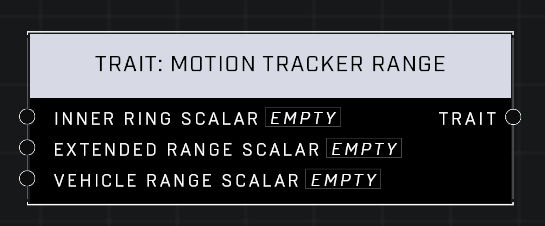

# Trait: Motion Tracker Range

## Description
Affects the various ranges of the Motion Tracker. Scalars of 1.0 are the default. Higher values mean the player's Combat Sensor will track targets farther away.

## Node Type
Nodes fall into two basic categories: Data and Execution. This node supplies Data for an Execution node.

## Inputs
| Input | Type | Required | Description |
|------------------|------------------|----------|--------------------------------------------------------------|
| Inner Ring Scalar | Number (0.0 - 10) | Yes | What percentage of default. |
| Extended Range Scalar | Number (0.0 - 10) | Yes | What percentage of default. |
| Vehicle Range Scalar | Number (0.0 - 10) | Yes | What percentage of default. |

## Outputs
| Output | Type | Description |
|------------------|------------------|--------------------------------------------------------------|
| Trait | Trait | Outputs this trait. |

\
\
**Contributors**

AddiCt3d 2CHa0s
