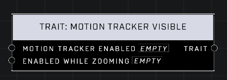

# Trait: Motion Tracker Visible

## Description
When disabled, the Motion Tracker will not appear in the affected player's HUD. Can also set whether the Combat Sensor appears while zoomed.

## Node Type
Nodes fall into two basic categories: Data and Execution. This node supplies Data for an Execution node.

## Inputs
| Input | Type | Required | Description |
|------------------|------------------|----------|--------------------------------------------------------------|
| Motion Tracker Enabled | Boolean | Yes | If TRUE Motion Tracker is visible, otherwise it's not. |
| Enabled While Zooming| Boolean | Yes | If TRUE trait is enabled, otherwise removes it. |

## Outputs
| Output | Type | Description |
|------------------|------------------|--------------------------------------------------------------|
| Trait | Trait | Outputs this trait. |

\
\
**Contributors**

AddiCt3d 2CHa0s
