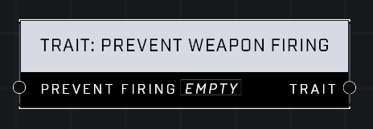

# Trait: Prevent Weapon Firing

## Description
When Prevent Firing is true, affected players may not fire their weapons

## Node Type
Nodes fall into two basic categories: Data and Execution. This node supplies Data for an Execution node.

## Inputs
| Input | Type | Required | Description |
|------------------|------------------|----------|--------------------------------------------------------------|
| Prevent Firing | Boolean | Yes | If TRUE trait is enabled, otherwise removes it. |

## Outputs
| Output | Type | Description |
|------------------|------------------|--------------------------------------------------------------|
| Trait | Trait | Outputs this trait. |

\
\
**Contributors**

AddiCt3d 2CHa0s
