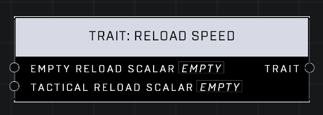

# Trait: Reload Speed

## Description
Affects how fast a player reloads their weapon when empty or when there are some rounds remaining (Tactical Reload). A scalar of 1.0 is default for both pins. Higher values mean the player reloads faster.

## Node Type
Nodes fall into two basic categories: Data and Execution. This node supplies Data for an Execution node.

## Inputs
| Input | Type | Required | Description |
|------------------|------------------|----------|--------------------------------------------------------------|
| Empty Reload Scalar | Number (0.0 - 10) | Yes | What percentage of default. |
| Tactical Reload Scalar | Number (0.0 - 10) | Yes | What percentage of default. |

## Outputs
| Output | Type | Description |
|------------------|------------------|--------------------------------------------------------------|
| Trait | Trait | Outputs this trait. |

\
\
**Contributors**

AddiCt3d 2CHa0s
