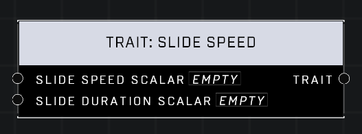

# Trait: Slide Speed

## Description
Affects the speed and duration of a player's slides. A scalar of 1.0 is default for both pins. Higher values mean the player slides faster and longer, respectively.

## Node Type
Nodes fall into two basic categories: Data and Execution. This node supplies Data for an Execution node.

## Inputs
| Input | Type | Required | Description |
|------------------|------------------|----------|--------------------------------------------------------------|
| Slide Speed Scalar | Number (0.0 - 10) | Yes | What percentage of default. |
| Slide Duration Scalar | Number (0.0 - 10) | Yes | What percentage of default. |

## Outputs
| Output | Type | Description |
|------------------|------------------|--------------------------------------------------------------|
| Trait | Trait | Outputs this trait. |

\
\
**Contributors**

AddiCt3d 2CHa0s
