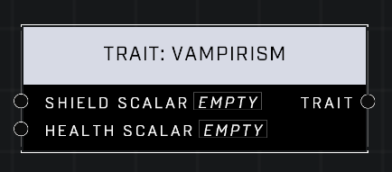

# Trait: Vampirism

## Description
Affects how much vitality a player recovers by dealing damage to shields or health. A scalar of 0 is default for both pins. Higher values mean the player heals more when they deal damage.

## Node Type
Nodes fall into two basic categories: Data and Execution. This node supplies Data for an Execution node.

## Inputs
| Input | Type | Required | Description |
|------------------|------------------|----------|--------------------------------------------------------------|
| Shield Scalar | Number (0.0 - 10) | Yes | What percentage of default. |
| Health Scalar | Number (0.0 - 10) | Yes | What percentage of default. |

## Outputs
| Output | Type | Description |
|------------------|------------------|--------------------------------------------------------------|
| Trait | Trait | Outputs this trait. |

\
\
**Contributors**

AddiCt3d 2CHa0s
