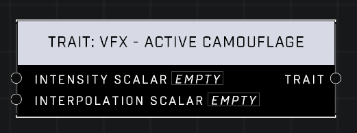

# Trait: VFX - Active Camouflage

## Description
Sets the intensity of the Active Camouflage visual effect on the player. An Intensity Scalar of 0 leaves the player fully visible while a value of 1 applies perfect camo. Interpolation Scalar controls how fast the player fades.

## Node Type
Nodes fall into two basic categories: Data and Execution. This node supplies Data for an Execution node.

## Inputs
| Input | Type | Required | Description |
|------------------|------------------|----------|--------------------------------------------------------------|
| Intensity Scalar | Number (0.0 - 10) | Yes | What percentage of default. |
| Interpolation Scalar | Number (0.0 - 10) | Yes | What percentage of default. |

## Outputs
| Output | Type | Description |
|------------------|------------------|--------------------------------------------------------------|
| Trait | Trait | Outputs this trait. |

\
\
**Contributors**

AddiCt3d 2CHa0s
