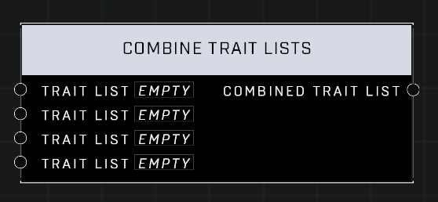

# Combine Trait Lists

## Description
Returns a list combining all theinput Trait Lists. Duplicate trait values will be removed from the new list, if they exist.

## Node Type
Nodes fall into two basic categories: Data and Execution. This node supplies Data for an Execution node.

## Inputs
| Input | Type | Required | Description |
|------------------|------------------|----------|--------------------------------------------------------------|
| Trait List | Trait List | Yes | A list of Traits to combine. |
| Trait List | Trait List | Yes | A list of Traits to combine. |
| Trait List | Trait List | Yes | A list of Traits to combine. |
| Trait List | Trait List | Yes | A list of Traits to combine. |

## Outputs
| Output | Type | Description |
|------------------|------------------|--------------------------------------------------------------|
| Combined Trait List | Trait List | A list of all Traits from inputs. |

\
\
**Contributors**

AddiCt3d 2CHa0s