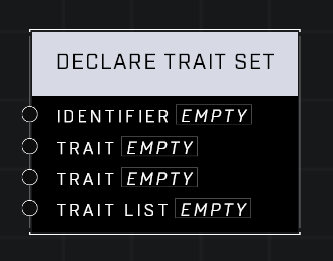

# Declare Trait Set

## Description
Creates a named collection of Unit Traits at global scope as soon as the node graph script runs. Trait Sets cannot be modified after creation. Apply the set to units using nodes like Apply Trait Set.

## Node Type
Nodes fall into two basic categories: Data and Execution. This node Executes a function when the game loads.

## Inputs
| Input | Type | Required | Description |
|------------------|------------------|----------|--------------------------------------------------------------|
| Identifier | String | Yes | Custom name of this variable. |
| Trait | Trait | No | A trait to be added to this trait set. |
| Trait | Trait | No | A trait to be added to this trait set. |
| Trait List | Trait List | No | A list of Traits to add to this trait set. |

## Outputs
| Output | Type | Description |
|------------------|------------------|--------------------------------------------------------------|
| (none) | | |

\
\
**Contributors**

AddiCt3d 2CHa0s