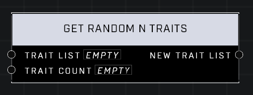

# Get Random N Traits

## Description
Gets N traits from the Trait List at random.

## Node Type
Nodes fall into two basic categories: Data and Execution. This node supplies Data for an Execution node.

## Inputs
| Input | Type | Required | Description |
|------------------|------------------|----------|--------------------------------------------------------------|
| Trait List | Trait List | Yes | A list of traits to pull random traits from. |
| Trait Count | Number | Yes | Max random traits to pull from the list. |

## Outputs
| Output | Type | Description |
|------------------|------------------|--------------------------------------------------------------|
| New Trait List | Trait List | List of the random traits. |

\
\
**Contributors**

AddiCt3d 2CHa0s