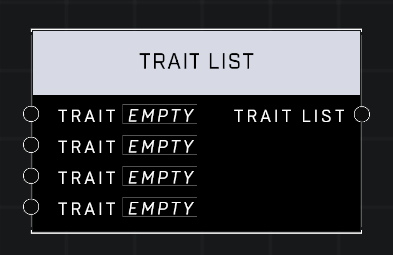

# Trait List

## Description
Stores a list of player Traits. Traits in list are ordered and unique, meaning adding a duplicate trait will have no effect.

## Node Type
Nodes fall into two basic categories: Data and Execution. This node supplies Data for an Execution node.

## Inputs
| Input | Type | Required | Description |
|------------------|------------------|----------|--------------------------------------------------------------|
| Trait | Trait | No | A trait to add to the list. |
| Trait | Trait | No | A trait to add to the list. |
| Trait | Trait | No | A trait to add to the list. |
| Trait | Trait | No | A trait to add to the list. |

## Outputs
| Output | Type | Description |
|------------------|------------------|--------------------------------------------------------------|
| Trait List | Trait List | A list of all Traits from inputs. |

\
\
**Contributors**

AddiCt3d 2CHa0s