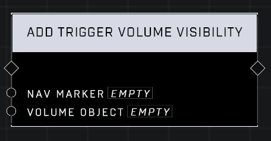

# Add Trigger Volume Visibility

## Description
Shows Nav Marker for players who are in the volume. Maximum 8 volumes per marker.

## Node Type
Nodes fall into two basic categories: Data and Execution. This node Executes a function directly in the node string.

## Inputs
| Input | Type | Required | Description |
|------------------|------------------|----------|--------------------------------------------------------------|
| Nav Marker | Nav Marker | Yes | Which nav marker is affected by this node. |
| Volume Object | Volume Object | Yes | Which volume affects the nav marker. |

## Outputs
| Output | Type | Description |
|------------------|------------------|--------------------------------------------------------------|
| (none) | | |

\
\
**Contributors**

AddiCt3d 2CHa0s
