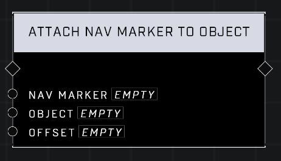

# Attach Nav Marker To Object

## Description
Attaches the Nav Marker to the Object with an optional Offset

## Node Type
Nodes fall into two basic categories: Data and Execution. This node Executes a function directly in the node string.

## Inputs
| Input | Type | Required | Description |
|------------------|------------------|----------|--------------------------------------------------------------|
| Nav Marker | Nav Marker | Yes | Which nav marker is affected by this node. |
| Object | Object | Yes | Which object nav marker will attach to. |
| Offset | Vector3 | No | Adds an offset to where nav marker appears on object's local position. |

## Outputs
| Output | Type | Description |
|------------------|------------------|--------------------------------------------------------------|
| (none) | | |

\
\
**Contributors**

AddiCt3d 2CHa0s