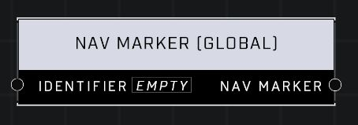

# Nav Marker Global

## Description
Creates a Global Nav Marker that can be accessed by the output pin or using the Get Nav Marker (Global) node using the same identifier in any script brain.

## Node Type
Nodes fall into two basic categories: Data and Execution. This node supplies Data for an Execution node.

## Inputs
| Input | Type | Required | Description |
|------------------|------------------|----------|--------------------------------------------------------------|
| Identifier | String | Yes | Which nav marker will output. |

## Outputs
| Output | Type | Description |
|------------------|------------------|--------------------------------------------------------------|
| Nav Marker | Nav Marker | Outputs the global nav marker with the matching identifier. |

\
\
**Contributors**

AddiCt3d 2CHa0s