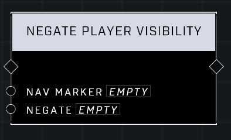

# Negate Player Visibility

## Description
Sets whether Nav Marker is visible to players who pass the Base Visibility filter or those who don't.

## Node Type
Nodes fall into two basic categories: Data and Execution. This node Executes a function directly in the node string.

## Inputs
| Input | Type | Required | Description |
|------------------|------------------|----------|--------------------------------------------------------------|
| Nav Marker | Nav Marker | Yes | Which nav marker is affected by this node. |
| Negate | Boolean | Yes | This filter's Set node must active for negate to work. If true, filter works when the opposite of it's defined occurs. If false, filter works as defined. |

## Outputs
| Output | Type | Description |
|------------------|------------------|--------------------------------------------------------------|
| (none) | | |

\
\
**Contributors**

AddiCt3d 2CHa0s